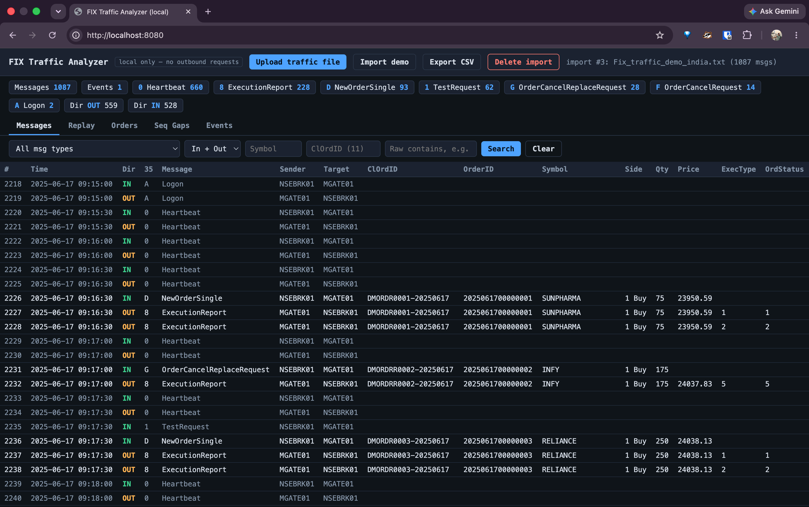
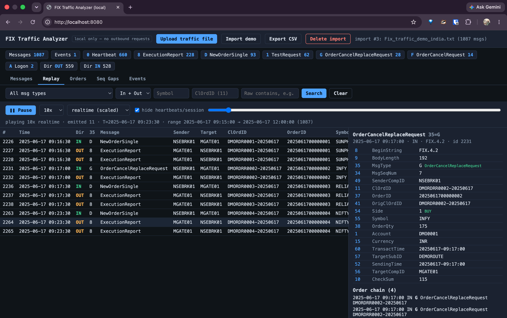

# FIX Traffic Analyzer

FIX Traffic Analyzer is a local Spring Boot application for importing,
inspecting, searching, and replaying FIX 4.2 traffic captures. It includes a
browser-based UI and a JSON/CSV API. The application is designed for local
analysis: uploaded captures and parsed data stay on the machine running the
service.

## Features

- Import FIX traffic files through the web UI or API.
- Parse enveloped log lines and raw FIX messages using `|` or SOH delimiters.
- Browse decoded FIX fields with dictionary names and values.
- Search and filter by message type, direction, symbol, client order ID, or text.
- Inspect orders, order chains, session events, and sequence-number gaps.
- Replay captured messages in real-time or burst mode through an SSE stream.
- Export filtered messages to CSV.
- Use synthetic India and US demo captures included in `samples/`.

## The FIX Batch Logic

The analyzer is built on a batch-import pipeline. Keep this pipeline intact
when changing the UI, API, search queries, or replay behavior:

1. `FixTrafficParser` parses one input line into a `ParsedLine`. It supports
   enveloped log lines, raw messages, `|` delimiters, SOH delimiters, and engine
   event lines.
2. `ImportService.importStream` creates one `import_batch`, processes the input
   sequentially, and stores every recognized line in `fix_log`.
3. FIX messages are additionally indexed in `fix_message` for filtering,
   order-chain lookup, sequence-gap detection, statistics, and export.
4. The import is transactional. If processing fails, the partial batch must
   not be treated as a completed import.

The database relationship is `import_batch` -> `fix_log` -> `fix_message`.
`fix_log.raw` remains the original parsed payload and is required for detail
views and text search. Do not replace the raw message with only extracted
fields.

### Safe Changes

- Change presentation in `src/main/resources/static/index.html` without
  changing import behavior.
- Add API filters in `QueryService` and corresponding controller parameters.
- Add an indexed FIX field by updating `schema.sql`, `ImportService.insertMessage`,
  the relevant model/query projections, and tests together.
- Extend supported capture formats in `FixTrafficParser`, keeping existing
  envelope, raw-message, event, and delimiter behavior compatible.
- Update `FixDictionaryService` or `custom-tags.properties` when adding names
  for tags or enumerated values.

When changing parser or batch-import code, update parser tests and verify that
message, event, blank, malformed, and mixed-delimiter lines still produce the
expected import counters. Keep `deleteImport` aligned with the three-table
relationship so deleting a batch removes all of its parsed data.

## Screenshots

Add screenshots of the running application to `docs/screenshots/` and update
the filenames below as needed.

### Message Browser



### Replay View



## Requirements

- Java 25
- Git
- Docker, only when using the PostgreSQL profile

The repository includes the Maven Wrapper, so Maven does not need to be
installed separately.

## Run Locally

The default `local` profile uses an in-memory H2 database and does not require
Docker or PostgreSQL.

```bash
./mvnw spring-boot:run
```

Open [http://localhost:8080](http://localhost:8080) in a browser. Use **Import
demo** to load the default sample capture, or use **Upload traffic file** to
load another capture.

The default sample path is:

```text
samples/Fix_traffic_demo_india.txt
```

To use a different default file, set `FIX_TRAFFIC_PATH`:

```bash
FIX_TRAFFIC_PATH=samples/Fix_traffic_demo_us.txt ./mvnw spring-boot:run
```

The local H2 database is recreated each time the application starts. An H2
console is available at [http://localhost:8080/h2-console](http://localhost:8080/h2-console)
using JDBC URL `jdbc:h2:mem:fixdb;DB_CLOSE_DELAY=-1;DB_CLOSE_ON_EXIT=FALSE`,
username `sa`, and an empty password.

## PostgreSQL

For larger or shared datasets, run the PostgreSQL profile. Docker must be
running because Spring Boot uses `compose.yaml` to start PostgreSQL.

```bash
./mvnw spring-boot:run -Dspring-boot.run.profiles=postgres
```

The default connection settings match `compose.yaml`:

```text
Host: localhost
Port: 5432
Database: mydatabase
User: myuser
Password: secret
```

For production use, replace these development credentials through Spring
configuration or environment-specific settings.

## API

The UI uses the following main endpoints:

| Method | Endpoint | Purpose |
| --- | --- | --- |
| `POST` | `/api/imports` | Upload a traffic file as multipart field `file` |
| `POST` | `/api/imports/default` | Import the configured default file |
| `GET` | `/api/imports` | List imports |
| `DELETE` | `/api/imports/{id}` | Delete an import and its parsed data |
| `GET` | `/api/messages` | Search and page through messages |
| `GET` | `/api/messages/{id}` | Get message details and decoded fields |
| `GET` | `/api/messages/{id}/chain` | Get the related order chain |
| `GET` | `/api/orders` | List order groups |
| `GET` | `/api/gaps` | Find sequence-number gaps |
| `GET` | `/api/events` | List non-message events |
| `GET` | `/api/stats` | Get message statistics |
| `GET` | `/api/export.csv` | Export the current filter result |
| `GET` | `/api/replay/meta` | Get replay range and message count |
| `GET` | `/api/replay/stream` | Stream replayed messages using Server-Sent Events |

Example upload:

```bash
curl -F 'file=@samples/Fix_traffic_demo_us.txt' http://localhost:8080/api/imports
```

## Generate Demo Captures

The checked-in captures are synthetic and contain no real sessions, orders, or
counterparties. Regenerate them with:

```bash
python3 scripts/generate_demo_fix.py
```

## Build And Test

```bash
./mvnw test
./mvnw clean package
```

The packaged application can be run with:

```bash
java -jar target/fix-batch-service-0.0.1-SNAPSHOT.jar
```

## Project Layout

```text
src/main/java/       Application, parser, services, models, and REST controllers
src/main/resources/  Profiles, database schema, FIX tags, and the web UI
src/test/            Unit and application tests
samples/             Synthetic FIX traffic captures
scripts/             Demo capture generator
compose.yaml         Development PostgreSQL service
```
